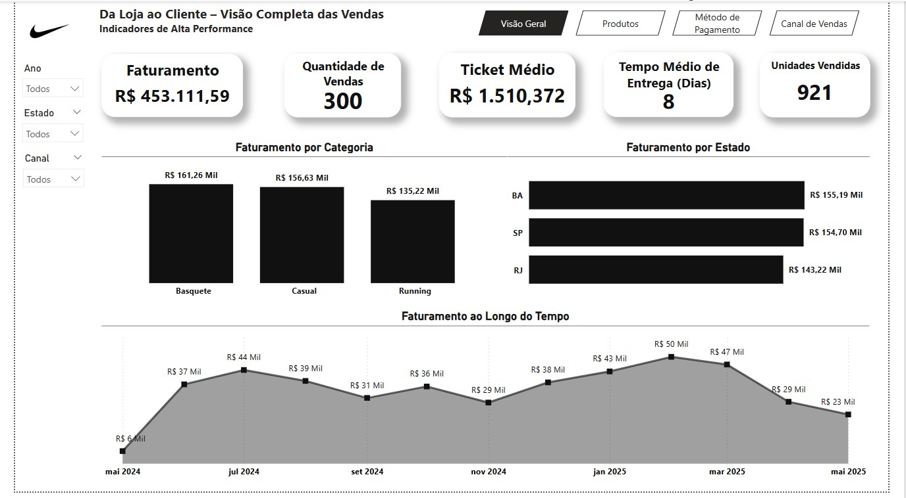

# 📊 Projeto de Análise de Vendas - Nike

Este projeto consiste em uma análise de vendas utilizando dados reais disponibilizados pela própria Nike.  

## 🏆 Objetivo do Projeto

O objetivo é aplicar técnicas de modelagem de dados, ETL, criação de KPIs com DAX e desenvolvimento de um dashboard interativo no Power BI.

## 📂 Estrutura do Projeto

projeto-analise-vendas-nike/

├── dados_brutos/ # Base de dados original 

├── powerbi/ # Arquivo .pbix e medidas DAX

├── imagens/ # Capturas de tela do dashboard

## 🛠️ Tecnologias Utilizadas

- Power BI Desktop
- DAX
- Excel (dados brutos)

## 📈 Métricas Analisadas (KPIs)

- Total de Unidades Vendidas
- Faturamento Total
- Quantidade de Vendas
- Ticket Médio
- Percentual de Desconto Médio
- Tempo Médio de Entrega
- Produto Mais Vendido
- Análise por Categoria
- Análise por Estado

## 📷 Prévia do Dashboard



## 🚀 Como Abrir o Projeto

1. Clone o repositório:
```bash
git clone https://github.com/seuusuario/projeto-analise-vendas-nike.git
```
2. Abra o arquivo dashboard_nike.pbix na sua instalação local do Power BI Desktop.

3. Caso queira, explore o dataset original em /dados_brutos.

👨‍💻 Autor

Douglas Vittori

[LinkedIn](https://www.linkedin.com/in/douglasvittori)
